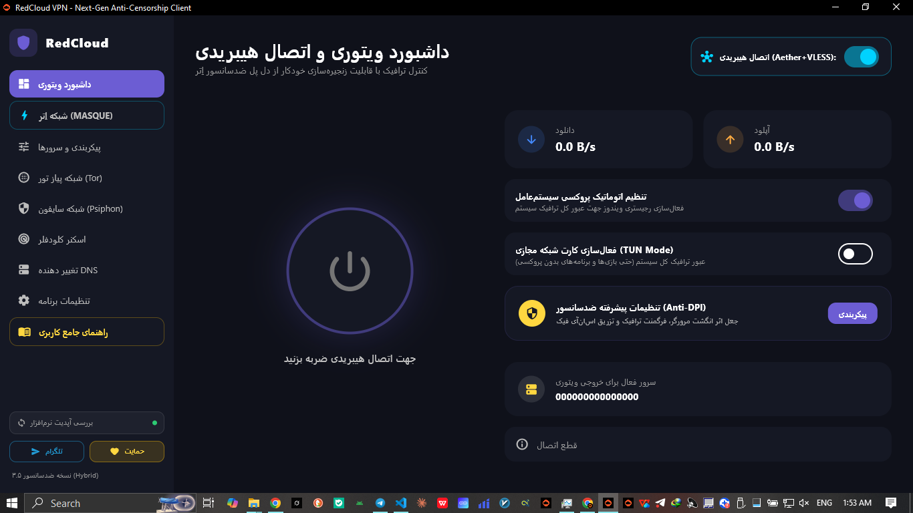
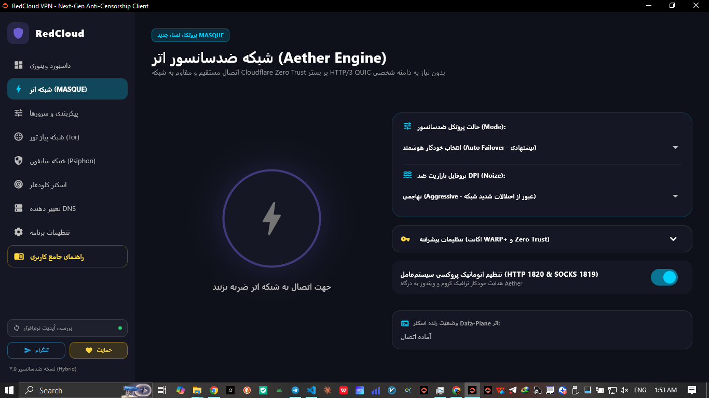
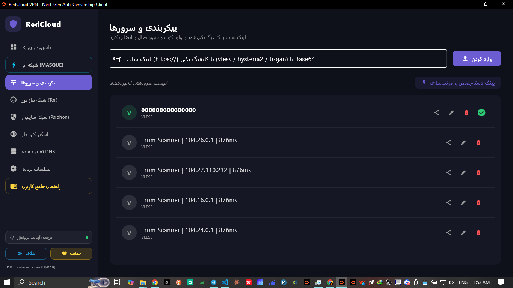
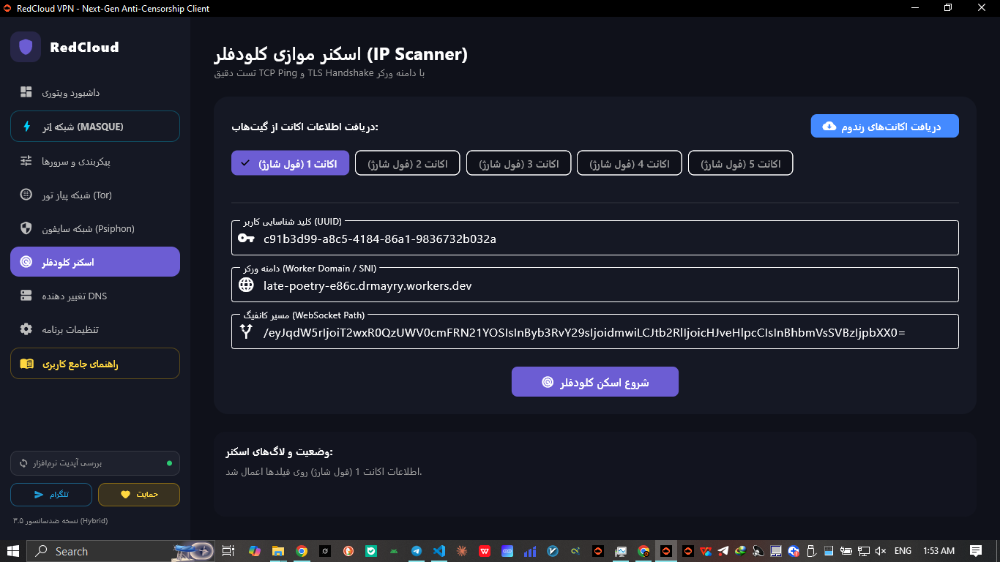
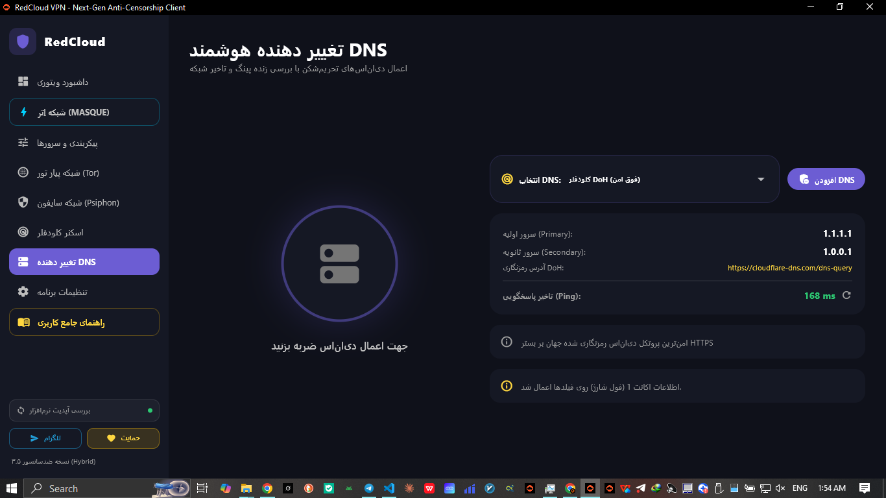
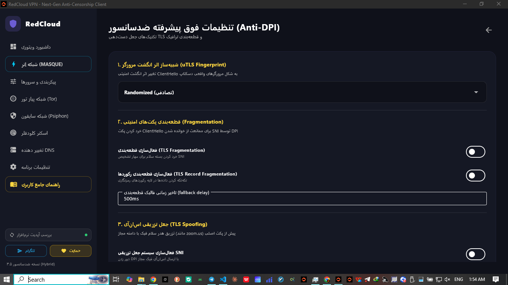

<div align="center">

# 🛡️ RedCloud VPN (نسخه ۳.6 هیبریدی ویندوز)

### کلاینت نسل جدید ضدسانسور، فوق‌سریع و چند‌هسته‌ای برای ویندوز

**Next-Generation Anti-Censorship Client for Windows Powered by Flutter & Rust**

[](https://github.com/Devtahas/RedCloud-windows/releases/latest)
[](LICENSE)
[](https://github.com/Devtahas/RedCloud-windows/releases/latest)
[](https://flutter.dev)
[](https://www.rust-lang.org)
[](https://github.com/SagerNet/sing-box)
[](https://t.me/DevTaha_project)

<br>


<p align="center">
<b>ردکلاود (RedCloud)</b> یک کلاینت جامع، سبک و فوق‌العاده مقاوم در برابر شدیدترین اختلالات و فیلترینگ اینترنت است که با تلفیق رابط کاربری مدرن <b>Flutter</b> و هسته باینری پرسرعت <b>Rust</b> برای ویندوز توسعه یافته است.
</p>

[📥 دانلود فایل نصبی مستقیم](https://github.com/Devtahas/RedCloud-windows/releases/latest) • [📢 کانال تلگرام](https://t.me/DevTaha_project) • [📖 راهنمای کاربری](#-راهنمای-دانلود-و-نصب) • [❤️ حمایت مالی](#-حمایت-مالی-از-پروژه-donate)

</div>

---

## 🌟 معماری شبکه و جریان ترافیک (Traffic Flow)

در حالت اتصال هیبریدی، ترافیک بدون شناسایی توسط فایروال‌های DPI از دو لایه عبور می‌کند:

```text
[ کاربر / کل ترافیک سیستم‌عامل ویندوز ]
                    │
                    ▼
   [ کارت شبکه مجازی Wintun یا پروکسی سیستم ]
                    │
                    ▼
   [ هسته ویتوری (Sing-box v1.13.13) ]
                    │
                    │ VLESS Reality / Hysteria 2 / Trojan / ECH
                    │
                    │ زنجیره‌سازی از SOCKS5: 127.0.0.1:1819
                    ▼
   [ پل ضدسانسور اِتر (Aether MASQUE) ]
                    │
                    │ HTTP/3 QUIC 0-RTT / H2 Fragment
                    ▼
   [ لایه ابری Cloudflare Edge ]
                    │
                    ▼
            [ اینترنت آزاد بدون فیلتر ]
```

---

## 📸 تصاویر محیط نرم‌افزار (Screenshots)

<div align="center">

<table>
<tr>
<td width="50%">

<h4 align="center">داشبورد ویتوری و اتصال هیبریدی</h4>



</td>
<td width="50%">

<h4 align="center">شبکه ضدسانسور اِتر (MASQUE H3)</h4>



</td>
</tr>

<tr>
<td width="50%">

<h4 align="center">پیکربندی سرورها (Reality & Hysteria 2)</h4>



</td>
<td width="50%">

<h4 align="center">اسکنر موازی آی‌پی‌های کلودفلر</h4>



</td>
</tr>

<tr>
<td width="50%">

<h4 align="center">تغییر‌دهنده هوشمند DNS (DoH / DoT)</h4>



</td>
<td width="50%">

<h4 align="center">تنظیمات پیشرفته ضد DPI و جعل هویت</h4>



</td>
</tr>
</table>

</div>

---

## ✨ قابلیت‌ها و ویژگی‌های کلیدی

### ⚡ ۱. فناوری اتصال هیبریدی انقلابی (Hybrid Bridge)

* ترافیک شما ابتدا از پل رمزنگاری‌شده و فوق‌پایدار **Aether (HTTP/3 QUIC)** عبور کرده و سپس به هسته قدرتمند **Sing-box** زنجیره‌سازی می‌شود.
* زنده کردن Workerهای مسدودشده و دریافت آی‌پی‌های خارجی معتبر بدون افت سرعت و Packet Loss.

### 🌐 ۲. پشتیبانی از مدرن‌ترین پروتکل‌های ضدسانسور

* **Hysteria 2 (hy2://):** الگوریتم کنترل ازدحام اختصاصی بر بستر UDP برای عبور پرسرعت از Packet Lossهای شدید شبکه.
* **VLESS Reality (pbk, sid, spx):** دور زدن فیلترینگ بدون نیاز به دامنه با جعل کامل هویت وب‌سایت‌های خارجی معتبر.
* **MASQUE H3 & H2:** اتصال مستقیم به شبکه Zero Trust کلودفلر با پروتکل HTTP/3.
* **پشتیبانی کامل از Trojan، WireGuard و Gool (WARP-in-WARP).**
* **رمزنگاری هدرهای کلاینت ECH (Encrypted Client Hello).**

### 🛡️ ۳. کارت شبکه مجازی سیستمی (TUN Mode)

* مجهز به درایور رسمی و پرسرعت **Wintun.dll**.
* عبور دادن ۱۰۰٪ ترافیک کل رایانه، شامل بازی‌های آنلاین، برنامه‌های بدون پروکسی، CMD، Git و کلاینت‌ها.
* جلوگیری کامل از نشت اطلاعات (DNS Leak & WebRTC Leak Protection).

### 🔒 ۴. جعبه‌ابزار پیشرفته ضد DPI (Anti-DPI)

* **شبیه‌ساز اثر انگشت (uTLS Fingerprint):** جعل کامل هویت بسته دست‌دهی به شکل مرورگر Google Chrome، Firefox، Safari یا Edge.
* **قطعه‌بندی پکت‌ها (TLS Fragmentation & Record Fragmentation):** خرد کردن بسته‌ها جهت ممانعت از خوانده شدن SNI توسط حسگرهای فیلترینگ.
* **تزریق دامنه فیک (TLS Spoofing):** دور زدن فیلترینگ هوشمند با تزریق هدر مجاز مانند `zoom.us`.

### 🔍 ۵. اسکنر دوحالته آی‌پی‌های تمیز کلودفلر (IP Scanner)

* **اسکن سریع (Quick Scan):** تست هم‌زمان TCP Ping و TLS Handshake لایه ۷ وب‌ساکت و بررسی پاسخ `HTTP 101`.
* **اسکن عمیق (Deep Scan):** اسکن موازی هزاران آی‌پی از دل رنج‌های ابری فایل `cloudflare_IPs.txt`.
* چرخش خودکار اکانت‌ها (Auto-Rotation) و دریافت سرورهای تازه از گیت‌هاب در صورت اتمام حجم.

### 🧅 ۶. شبکه‌های گمنامی تور (Tor) و سایفون (Psiphon)

* **Tor over MASQUE:** عبور گره‌های گارد شبکه تور از دل پل MASQUE جهت جلوگیری از مسدودسازی، با امکان تعیین کشور خروجی (Exit Node).
* **Psiphon over MASQUE:** استفاده از هسته رسمی سایفون با پایداری لایه انتقال MASQUE.

### 🎮 ۷. تغییردهنده هوشمند DNS (تحریم‌شکن و گیمینگ)

* بدون نیاز به روشن کردن VPN، تحریم‌های سایت‌های هوش مصنوعی، دیسکورد، اپیک‌گیمز، گیت‌هاب، ادوبی و داکر را دور بزنید.
* پشتیبانی از پروتکل‌های رمزنگاری‌شده DoH / DoT و تحریم‌شکن‌های بومی شامل شکن، الکترو، ۴۰۳ آنلاین و رادار گیم.

---

## 🚀 راهنمای دانلود و نصب

### روش پیشنهادی: نصب خودکار با فایل Setup

1. به [**صفحه آخرین انتشار (Releases)**](https://github.com/Devtahas/RedCloud-windows/releases/latest) بروید.
2. فایل نصبی **RedCloud_VPN_Setup_v3.5.exe** را دانلود کنید.
3. فایل را اجرا کرده و مراحل نصب را به‌سادگی طی کنید. برنامه به‌صورت خودکار در منوی Start و دسکتاپ قرار می‌گیرد.

> 💡 **نکته:**
> برنامه به‌صورت خودکار با دسترسی Administrator اجرا می‌شود و دارای قابلیت قرارگیری در کنار ساعت ویندوز (System Tray) و اجرای خودکار با بالا آمدن ویندوز (Startup) است.

---

## 🛠️ کامپایل و بیلد از سورس‌کد (برای توسعه‌دهندگان)

### پیش‌نیازها

* **Flutter SDK** نسخه ۳.۲۲ به بالا
* **Rust Toolchain** نسخه Stable `x86_64-pc-windows-msvc`
* **Inno Setup 6** برای ساخت فایل نصبی خروجی

```powershell
# ۱. کلون کردن ریپازیتوری
git clone https://github.com/Devtahas/RedCloud-windows.git
cd RedCloud-windows

# ۲. نصب ابزار کدهای پل FFI و تولید کدهای رابط
cargo install flutter_rust_bridge_codegen --version 2.12.0 --locked
flutter_rust_bridge_codegen generate

# ۳. دریافت پکیج‌های فلاتر
flutter pub get

# ۴. اجرای برنامه در حالت توسعه (Debug)
flutter run -d windows

# ۵. بیلد نسخه نهایی (Release)
flutter build windows --release

# ۶. ساخت فایل Setup ویندوز با Inno Setup
& "C:\Program Files (x86)\Inno Setup 6\ISCC.exe" installer.iss
```

---

## 📂 ساختار سورس‌کد پروژه (Project Structure)

```text
RedCloud-windows/
├── .github/
│   └── workflows/
│       └── release.yml           # پایپ‌لاین CI/CD بیلد و انتشار اتوماتیک
├── assets/
│   └── app_icon.ico              # آیکون ویندوز و فایل‌های گرافیکی
├── lib/
│   ├── main.dart                 # کنترلر اصلی، UI فلاتر و مدیریت تب‌ها
│   └── src/rust/                 # کدهای جنریت‌شده پل ارتباطی FFI
├── rust/
│   ├── src/api/simple.rs         # هسته بک‌اند راست، مدیریت Job Objects و پروسه‌ها
│   └── Cargo.toml                # وابستگی‌های کریت راست (windows-sys, serde, ...)
├── installer.iss                 # اسکریپت ساخت فایل نصبی Inno Setup
├── pubspec.yaml                  # تنظیمات و پکیج‌های فلاتر
└── README.md
```

---

## 📜 پروانه و شرایط استفاده (License)

این نرم‌افزار تحت پروانه بین‌المللی [**Apache License 2.0**](LICENSE) منتشر شده است.

* ✅ **استفاده و توسعه شخصی:** مطالعه سورس‌کد، توسعه و استفاده از برنامه کاملاً آزاد و متن‌باز است.
* ⚠️ **حقوق انحصاری برند و نام تجاری (Trademark Protection):** استفاده از نام **"RedCloud"**، **"RedCloud VPN"**، لوگوها و هویت رسمی پروژه در نسخه‌های فورک‌شده یا برنامه‌های اشتقاقی **ممنوع** است و توسعه‌دهندگان دیگر موظفند نسخه‌های تغییریافته خود را با **نام و برند کاملاً مجزا** منتشر نمایند.

---

## ❤️ حمایت مالی از پروژه (Donate)

توسعه، نگهداری و ارتقای مداوم سرورهای ضدسانسور نیازمند منابع مالی و سرورهای پایدار است. اگر این نرم‌افزار برای شما مفید بوده است، با حمایت مالی خود به بقا و گسترش اینترنت آزاد کمک کنید.

<div align="center">

| شبکه (Network)              | رمزارز (Asset) | آدرس ولت (Wallet Address)                    |
| --------------------------- | -------------- | -------------------------------------------- |
| **BNB Smart Chain (BEP20)** | **USDT (تتر)** | `0xDeda28Aa73Ec089A77B3fC616E0011a8fce12900` |

</div>

---

## 📢 ارتباط با ما و اخبار آپدیت‌ها

* 💬 **کانال رسمی تلگرام:** [**@DevTaha_project**](https://t.me/DevTaha_project)
* 🐙 **مخزن رسمی گیت‌هاب:** [**Devtahas/RedCloud-windows**](https://github.com/Devtahas/RedCloud-windows)
* 🐛 **گزارش باگ و پیشنهادات:** [**GitHub Issues**](https://github.com/Devtahas/RedCloud-windows/issues)

---

<div align="center">
<sub>ساخته شده با ❤️ برای آزادی اینترنت و حق دسترسی آزاد به اطلاعات برای همه</sub>
</div>
